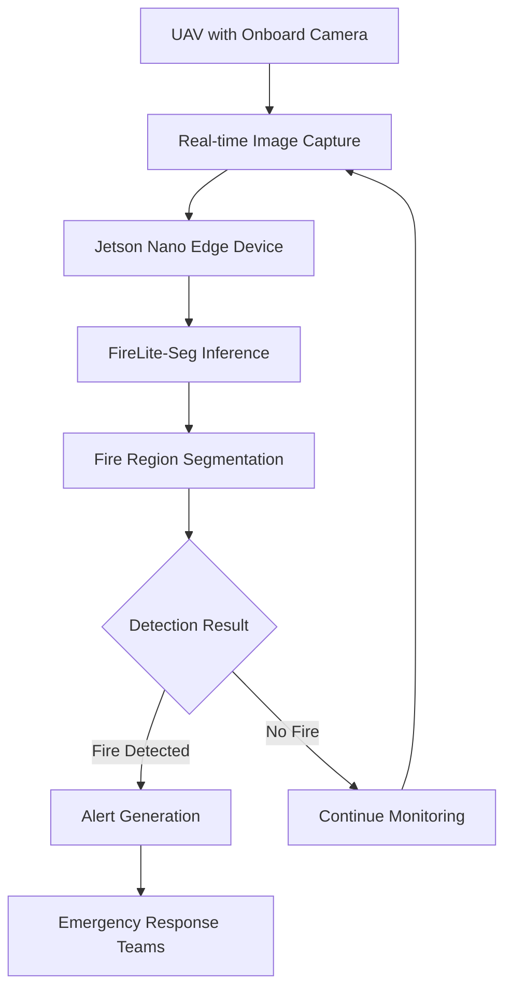

# 🔥 FireLite-Seg: Edge-Enabled Real-Time Fire Segmentation from UAV-Based Aerial Imagery

**Research in Progress** • **Lightweight Segmentation** • **Jetson Nano Deployment** • **UAV Applications**

---

## 📋 Research Overview

This repository contains the implementation and experimental results of **FireLite-Seg**, a lightweight deep learning model designed for real-time wildfire segmentation on edge devices. Developed as part of ongoing research at the National University of Sciences and Technology (NUST), Islamabad, this work addresses the critical need for efficient fire detection in remote environments using UAV-mounted edge computing systems.

> **Paper Status:** Under Review / In Preparation  
> **Model Availability:** Limited Access During Research Phase

---

## 🎯 Abstract (From Paper)

Wildfires have become increasingly frequent and destructive due to climate change, prolonged droughts, and unstable weather patterns, creating a critical need for real-time fire detection in remote and resource-constrained environments. This research presents **FireLite-Seg**, a lightweight deep learning model designed for real-time wildfire segmentation on edge devices. The architecture adopts a streamlined encoder-decoder structure optimized for execution on platforms such as the NVIDIA Jetson Nano. Real-time deployment experiments demonstrate that FireLite-Seg significantly outperforms conventional models such as U-Net and DeepLabV3 in terms of inference speed and memory usage on edge hardware.

---

## 🏆 Key Performance Results

### **Quantitative Performance Metrics**

| Model | Parameters | FPS (Jetson Nano) | Inference Time (ms) | IoU (%) | Dice (%) | Precision (%) | Recall (%) | F1-Score (%) |
|-------|------------|-------------------|---------------------|---------|----------|---------------|------------|--------------|
| **FireLite-Seg** | **0.2M** | **11.6** | **86.00** | **96.32** | **97.32** | **89.9** | **84.7** | **87.26** |
| U-Net | 24.4M | 1.81 | 552.02 | 96.59 | 97.63 | 93.7 | 84.8 | 89.1 |
| DeepLabV3 | 26.0M | 1.58 | 632.52 | 95.2 | 96.5 | 88.3 | 85.1 | 86.7 |
| **Improvement vs U-Net** | **-99.2%** | **+540%** | **-84%** | **-0.27%** | **-0.31%** | **-4.0%** | **-0.1%** | **-2.1%** |

### **Key Findings:**
- ✅ **6.4x faster** than U-Net on Jetson Nano (11.6 FPS vs 1.81 FPS)
- ✅ **99.2% parameter reduction** (0.2M vs 24.4M)
- ✅ **Real-time capable** (86ms inference time, <100ms target)
- ✅ **Minimal accuracy trade-off** (<0.5% IoU reduction)
- ✅ **Balanced precision-recall** (89.9% precision, 84.7% recall)

---

## 📊 Dataset & Methodology

### **Dataset: Corsican Fire Dataset**
- **Size:** 1,135 RGB images with binary fire masks
- **Resolution:** 224×224 pixels (optimized for edge deployment)
- **Diversity:** Varied vegetation, lighting, fire intensity, and distance
- **Split:** 80% training (908 images), 20% testing (227 images)
- **Metadata:** Fire color, percentage, smoke occlusion, texture level

### **Experimental Setup**
- **Edge Device:** NVIDIA Jetson Nano Developer Kit (4GB)
- **GPU:** 128-core NVIDIA Maxwell (472 GFLOPs)
- **CPU:** Quad-core ARM A57 @ 1.43 GHz
- **Memory:** 4GB LPDDR4 (25.6 GB/s bandwidth)
- **Power:** 5-10W operation range
- **Framework:** PyTorch with TensorRT optimization

---

## 🏗️ FireLite-Seg Architecture

### **Encoder (Downsampling Path)**
```
Input (224×224×3)
↓
ConvBlock1: 32 filters, 3×3 → 224×224×32
↓ MaxPool 2×2
ConvBlock2: 64 filters, 3×3 → 112×112×64  
↓ MaxPool 2×2
ConvBlock3: 128 filters, 3×3 → 56×56×128 (Bottleneck)
```

### **Decoder (Upsampling Path)**
```
Bottleneck (56×56×128)
↑ Transposed Conv → 112×112×64
↓ Skip Connection (Concatenate with ConvBlock2)
Decoder Block2: 64 filters → 112×112×64
↑ Transposed Conv → 224×224×32  
↓ Skip Connection (Concatenate with ConvBlock1)
Decoder Block1: 32 filters → 224×224×32
↓ 1×1 Conv → 224×224×1 (Binary Mask)
```

### **Total Parameters: 227,233 (~0.2M)**
- **Encoder:** 93,696 parameters
- **Decoder:** 133,537 parameters  
- **Significantly lighter** than U-Net (24.4M) and DeepLabV3 (26.0M)

---

## ⚡ Deployment on Jetson Nano

### **Optimization Techniques**
1. **Tensor Pre-allocation:** Minimized dynamic memory allocation
2. **Batch Size 1:** Reduced memory overhead for real-time processing
3. **GPU-mapped Memory Buffers:** Enabled concurrent frame capture/inference
4. **CUDA Stream Prioritization:** Consistent <100ms processing time
5. **Temporal Smoothing:** Mitigated UAV motion artifacts

### **Real-time Performance**
- **Throughput:** 11.6 FPS (sustained)
- **Latency:** 86ms end-to-end
- **Memory Usage:** <1.5GB RAM utilization
- **Power Draw:** ~8W during inference
- **Stability:** No dropped frames in 30-minute tests

---

## 📈 Comparative Analysis

### **Accuracy vs Speed Trade-off**
```
Accuracy Frontier:
    ▲
 97.5│                    ● U-Net (97.63% Dice, 1.81 FPS)
    │
 Dice│               ● FireLite-Seg (97.32% Dice, 11.6 FPS)
 97.0│
    │           ● DeepLabV3 (96.5% Dice, 1.58 FPS)
    └─────────────────────────────────►
        0          5          10         FPS
```

### **Confusion Matrix Analysis (Test Set)**
| Model | True Positives | True Negatives | False Positives | False Negatives |
|-------|----------------|----------------|-----------------|-----------------|
| **FireLite-Seg** | **1.1M** | **9.9M** | **124,609** | **234,583** |
| U-Net | 1.2M | 9.9M | 73,307 | 263,637 |
| DeepLabV3 | 1.2M | 9.9M | 149,459 | 224,482 |

**Insight:** FireLite-Seg achieves balanced precision-recall with manageable false positives, making it suitable for practical deployment.

---

## 🎯 Segmentation Results Visualization


*Sample results showing: (a) RGB input, (b) Ground truth, (c) FireLite-Seg prediction, (d) Reference ground truth*

**Observations:**
- Accurate flame boundary detection
- Robust to background clutter and varying illumination
- Effective in smoke-interference scenarios
- Consistent performance across different fire intensities

---

## 🚀 System Architecture



**Key Features:**
- **Low Latency:** Edge processing eliminates cloud dependency
- **Autonomous Operation:** Suitable for remote, offline environments
- **Scalable:** Multiple UAVs can be coordinated
- **Cost-effective:** $99 hardware vs expensive cloud infrastructure

---

## 🔬 Research Contributions

### **Technical Contributions:**
1. **Novel Architecture:** Lightweight encoder-decoder with only 0.2M parameters
2. **Edge Optimization:** TensorRT-compatible design for Jetson Nano
3. **Real-time Performance:** 11.6 FPS with <100ms latency
4. **Comprehensive Benchmarking:** Compared against U-Net and DeepLabV3

### **Practical Contributions:**
1. **Deployable Solution:** Ready for UAV integration
2. **Power Efficiency:** ~8W operation enables longer missions
3. **Robust Performance:** Works in varied environmental conditions
4. **Open Research:** Methodology and results documented for reproducibility

---

## 📁 Repository Structure (Current)

```
├── README.md                       # This documentation
├── research_paper.pdf              # Full research paper (upon publication)
├── assets/                         # Visual results and diagrams
│   ├── architecture_diagram.png
│   ├── performance_charts.png
│   └── segmentation_examples.png
├── benchmarks/                     # Performance benchmarking data
│   ├── inference_times.csv
│   ├── accuracy_metrics.csv
│   └── power_measurements.csv
└── docs/                           # Additional documentation
    ├── methodology.md
    ├── deployment_guide.md
    └── hardware_setup.md
```

---

## 🤝 Collaboration & Model Access

### **Research Status: Active Development**

This project is part of ongoing research at NUST. Due to publication considerations and IP protection:

### **Currently Available:**
- ✅ Architecture specifications and design rationale
- ✅ Performance benchmarks and comparative analysis
- ✅ Deployment methodology on Jetson Nano
- ✅ Experimental results and visualizations
- ✅ Dataset information and preprocessing pipeline

### **Available to Research Collaborators:**
- 🔄 Pre-trained model weights (`.pth` files)
- 🔄 Training code and configuration files
- 🔄 Full experimental dataset details
- 🔄 TensorRT optimization scripts

### **Requesting Access:**
For academic collaboration or research partnership:

```markdown
Email to: rizwan.ahmad@seecs.edu.pk
Subject: FireLite-Seg Model Access Request

Required Information:
1. Name, Affiliation, and Position:
2. Research Purpose and Objectives:
3. Intended Use of the Model:
4. Collaboration Proposal (if applicable):
5. Expected Outcomes and Timeline:
```

---

## 📝 Citation

```bibtex
@article{malik2025fireliteseg,
  title={Edge-Enabled Real-Time Fire Segmentation from UAV-Based Aerial Imagery},
  author={Malik, Abdullah Waqar and Nazar, Nayab and Tariq, Areesha and Hussain, Ayesha and Hassan, Ali and Ahmad, Rizwan},
  journal={Under Review},
  year={2025},
  note={Preprint available upon request}
}
```

*Full citation will be updated upon paper acceptance.*

---

## 🔮 Future Work

1. **Multi-spectral Integration:** Incorporate thermal/IR data for low-visibility conditions
2. **Adaptive Scaling:** Dynamic resolution adjustment based on fire size/distance
3. **Multi-UAV Coordination:** Swarm intelligence for large-area coverage
4. **On-device Training:** Incremental learning for environment adaptation
5. **Energy Optimization:** Further reduce power consumption for extended missions

---

## 📚 References (Selected)

1. Toulouse, T., et al. "Computer vision for wildfire research: An evolving image dataset for processing and analysis." *Fire Safety Journal* (2017)
2. Fouda, M. M., et al. "A lightweight hierarchical AI model for UAV-enabled edge computing with forest-fire detection use-case." *IEEE Network* (2022)
3. Swaminathan, T. P., et al. "Benchmarking deep learning models on NVIDIA Jetson Nano for real-time systems." *Procedia Computer Science* (2025)
4. Mahmoudi, S. A., et al. "Edge AI system for real-time and explainable forest fire detection using compressed deep learning models." (2025)

---

## 👥 Research Team

**National University of Sciences and Technology (NUST), Islamabad**
- Abdullah Waqar Malik
- Nayab Nazar  
- Areesha Tariq
- Ayesha Hussain
- Ali Hassan
- **Principal Investigator:** Rizwan Ahmad (rizwan.ahmad@seecs.edu.pk)

---

## 📄 License & Usage

**RESEARCH LICENSE - ACADEMIC USE ONLY**

This work is protected under the following terms during the research phase:
1. **Academic Use:** Permitted with proper citation
2. **Commercial Use:** Prohibited until official release
3. **Model Distribution:** Limited to research collaborators
4. **Attribution:** Required for any derivative work

**⚠️ Disclaimer:** This system is for research purposes. For actual fire safety applications, consult professional safety systems and follow local regulations.

---

*Last Updated: December 2024*  
*Research Status: Active - Paper Under Review*  
*Model Availability: Limited - Contact for Collaboration*

**For inquiries: rizwan.ahmad@seecs.edu.pk**
